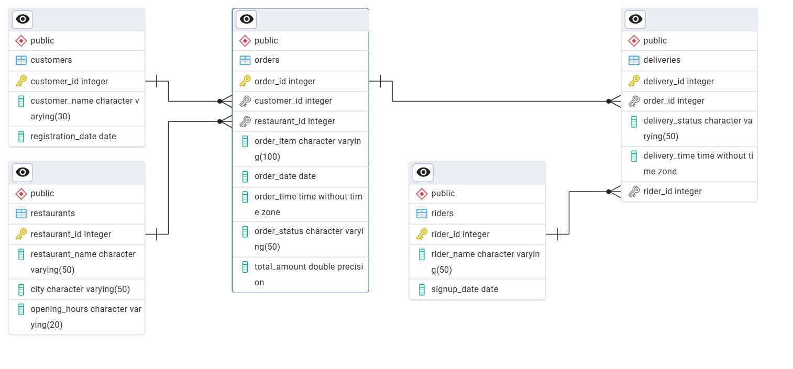
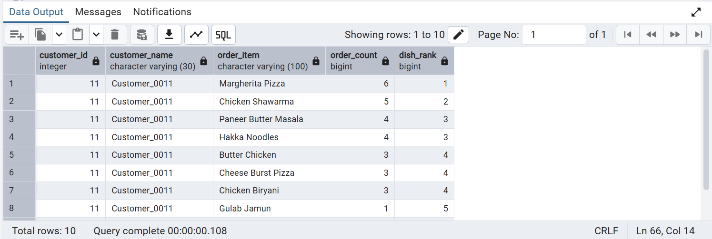
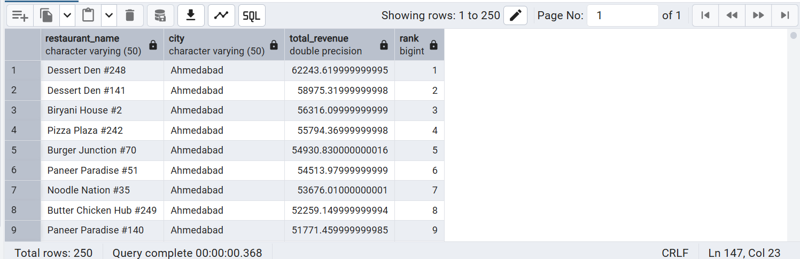
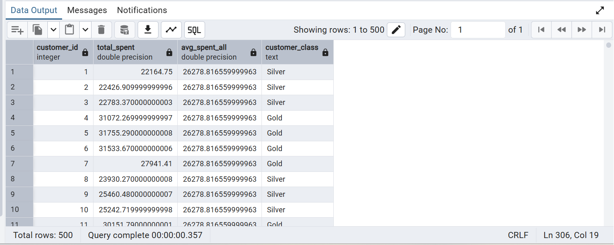
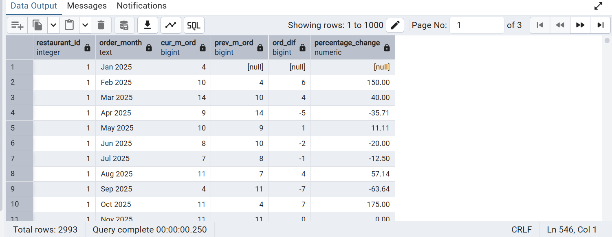

# PostgreSQL Zomato Analysis

End-to-end PostgreSQL analytics project using a food delivery dataset.

## Overview

This project analyzes a food delivery platform to uncover insights about:
- Customer ordering behavior
- Restaurant performance
- Revenue trends
- Customer segmentation
- Month-over-month growth

The analysis is done entirely using PostgreSQL with realistic relational data.

---

## Database Schema

The database is designed using a relational schema that models a real-world food delivery system.

### Tables
- customers
- restaurants
- orders
- deliveries
- riders

### Entity Relationship Diagram (ERD)



## SQL Analysis & Business Questions

This project contains **multiple analytical SQL queries** written in PostgreSQL.
Below are some **sample analyses and representative outputs** that highlight the type
of business questions addressed in the project.

## Sample Query Outputs

### 1. Q1 - Top Dishes Ordered by Each Customer

> Identifies individual customer preferences and repeat ordering patterns.

### 2. Q6 - Top Restaurants by Revenue (City-wise)

> Highlights high-performing restaurants and revenue concentration across cities.

### 3. Q12 - Customer Segmentation

> Segments customers based on spending behavior to identify high-value users.

### 4. Q20 - Month-over-Month Order Growth

> Tracks order growth trends over time and helps identify seasonality and performance shifts.

---

> These screenshots represent **selected outputs** from the analysis.  
> The complete set of SQL queries is available in `queries/02_queries.sql`.

---

## Project Structure

```text
postgres-zomato-analysis/
│
├── data/        # Raw CSV data files
├── schema/      # Database schema (DDL)
├── queries/     # Analytical SQL queries
├── outputs/     # Selected query result screenshots
├── erd/         # Entity Relationship Diagram
├── notes/       # Assumptions and notes
└── README.md

---

## How to Run This Project

1. Create a PostgreSQL database  
2. Run the schema file:

    \i schema/01_schema.sql

3. Load the CSV files into their respective tables  
4. Run the analytical queries:

    \i queries/02_queries.sql

---

## Tech Stack

- PostgreSQL
- SQL
- CSV
- GitHub

---

## SQL Concepts Used

- Joins (INNER, LEFT)
- Aggregations (SUM, COUNT, AVG)
- Window functions (RANK, LAG)
- Common Table Expressions (CTEs)
- Date and time analysis
- Conditional logic (CASE WHEN)

---

## Notes & Assumptions

- The dataset is fictional and created for learning purposes
- Screenshots represent selected outputs, not the complete analysis

---

## Author

Vaibhav  
PostgreSQL · SQL Analytics · Data Analysis
